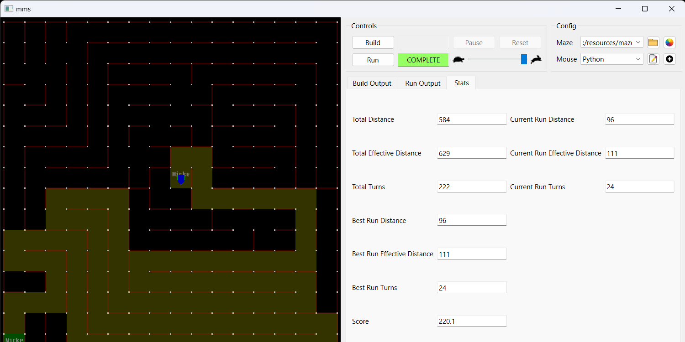
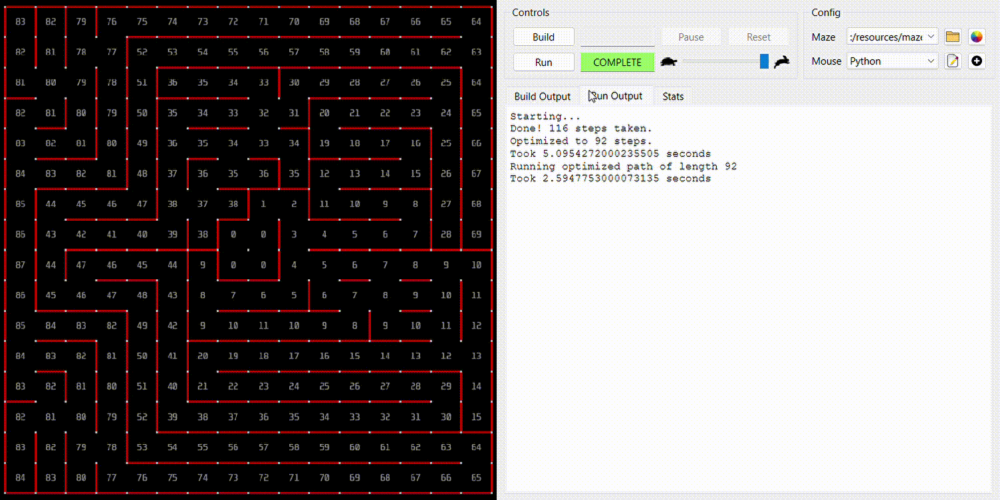
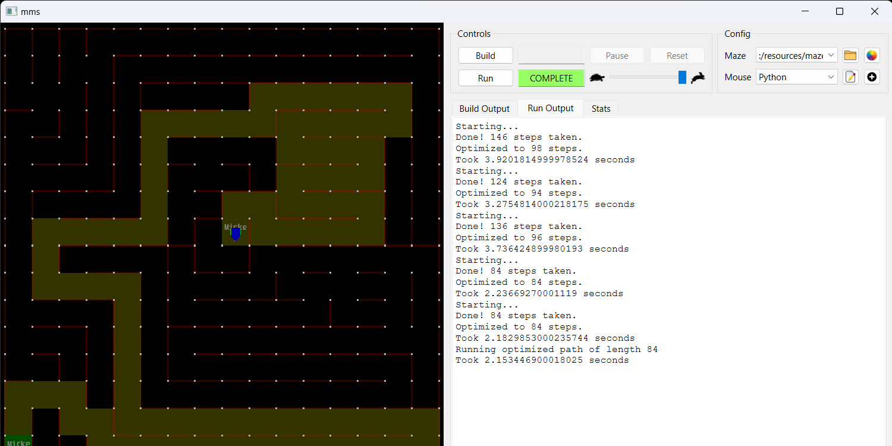

# Setup

```bash
$ git clone https://github.com/FallenDeity/FloodFillMMS
```

And yep you are done with the setup.

# Usage

Follow simulator installation instructions from [here](https://github.com/mackorone/mms)

Release link: [here](https://github.com/mackorone/mms/releases/tag/v1.1.0)

Follow the instructions from [here](https://github.com/mackorone/mms-python) to use it with python.

# Demo

### 3 Iterations





### 5 Iterations


